 

 

---

## 🧠 About Me

I got into coding because I wanted to **build things that actually work** — not just write code for the sake of it.

What began as curiosity about how websites are built in school quickly grew into a deep interest in **machine learning, IoT, and full-stack development**. I've never waited for formal instruction. When I want to build something, I learn through documentation, experimentation, and iteration.

- 🏔️ Based in **Kathmandu, Nepal**
- 🎓 Completing **AI/ML Microdegree** at AICN (AI Community of Nepal)
- 🤖 Passionate about **ML models, IoT systems & real-world AI applications**
- 🌱 Always exploring — when a new AI tool drops, I want to try it immediately
- 🎸 Outside of tech: **Guitar & Music**
- 📬 **rohitpoudel020@gmail.com**
- 🌐 **[rohitpoudel.com.np](https://www.rohitpoudel.com.np)**

---

## 🚀 Featured Projects

<table>
  <tr>
    <td width="50%" valign="top">
      <h3 align="center">🌍 Disaster Prediction System</h3>
      
Trained an <strong>XGBoost model</strong> on <strong>260,000+</strong> real building records from the 2015 Gorkha earthquake to predict which structures are most at risk of damage.

      

        
        
        
        
      

    </td>
    <td width="50%" valign="top">
      <h3 align="center">🏥 SajhaDoctor — Telehealth Platform</h3>
      
A full-stack <strong>doctor-patient consultation platform</strong> built with React and Node.js, enabling remote healthcare access across Nepal.

      

        
        
        
      

    </td>
  </tr>
  <tr>
    <td width="50%" valign="top">
      <h3 align="center">🏠 IoT Smart Residence System</h3>
      
An <strong>Arduino-based smart home system</strong> using environmental sensors for automated monitoring, lighting and alert systems.

      

        
        
        
      

    </td>
    <td width="50%" valign="top">
      <h3 align="center">🎨 Jamarko — Talent Platform</h3>
      
A community-driven platform where people could <strong>showcase and discover talents</strong> — art, music, dance. Built and promoted with real active users.

      

        
        
        
      

    </td>
  </tr>
</table>

---

## 🛠️ Tech Stack

<h4>Languages</h4>

<h4>ML / Data Science</h4>

<h4>Web Development</h4>

<h4>IoT & Hardware</h4>

<h4>Tools</h4>

---

## 📊 GitHub Stats

  

---

## 🌐 Connect With Me

---

<i>"I started coding because I wanted to build things that actually work — not just write code for the sake of it."</i>

  

